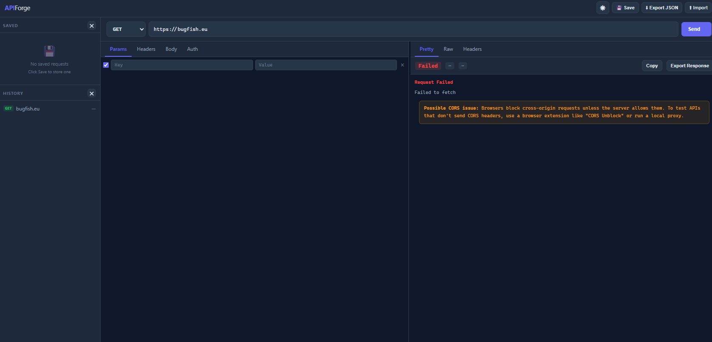

# APIForge — Request Tool

> [!TIP]
> This tool is actively maintained as a personal developer utility. Feature requests and bug reports are welcome via GitHub Issues and will be reviewed within 1–3 weeks.

> [!WARNING]
> ⚠️ CAUTION: This repository contains code developed with the assistance of Artificial Intelligence (AI). While functional, AI-generated code can introduce hidden bugs, security vulnerabilities, or logic flaws that may not be immediately apparent. Please thoroughly review, audit, and test all files in an isolated development environment before deployment, as this software is provided as-is and used entirely at your own risk.

## 🚀 Introduction

APIForge is a browser-based HTTP request tool built as a single self-contained HTML file — no server, no login, no activity logging, no backend. It runs entirely in the browser with no external dependencies and stores nothing beyond what you explicitly save to your browser's local storage.

The interface is built around a clean split-pane layout with a persistent sidebar for saved requests and history on the left, a full request builder in the center, and a live response viewer on the right. It supports all standard HTTP methods, query parameter syncing, key-value headers, multiple body content types, and built-in authentication helpers. Responses are rendered with syntax-highlighted JSON tree inspection, a formatted headers table, and raw output — all without installing anything.

It is intended as a compact, focused alternative to heavier tools like Postman or Insomnia — entirely within the browser, with no account, no tracking, and no friction.

---

## 🔥 Features

A comprehensive feature set covering all standard HTTP request workflows with a polished, production-ready interface.

### 🛡️ Privacy & Zero Dependencies

No API key is required for the tool itself. All requests go directly from your browser to whatever endpoint you specify — nothing passes through any intermediate server. No cookies, no telemetry of any kind beyond browser-local storage for saved requests and history. The interface is fully offline-capable — load the file once and it still runs; only the API calls you make require connectivity.

### 📡 Request Builder

A full HTTP request builder with method selector, URL input, and one-click send:

| Method | Color |
|---|---|
| GET | Green |
| POST | Amber |
| PUT | Blue |
| PATCH | Purple |
| DELETE | Red |
| HEAD / OPTIONS | Grey |

URL parameters stay in sync with the params table — editing either updates the other automatically. Press **Enter** in the URL bar to send immediately.

### 🗂️ Params & Headers

Key-value tables for both query parameters and request headers. Each row has an enable/disable toggle so individual entries can be excluded from a request without deleting them. New rows are added with a single click and removed with the `×` button on hover.

### 📝 Request Body

A body editor with selectable content types:

| Type | Description |
|---|---|
| `none` | No body sent |
| `raw` | Plain text body |
| `JSON` | Raw JSON with format / beautify button |
| `form-data` | Multipart form data as key-value pairs |
| `x-www-form-urlencoded` | URL-encoded form data as key-value pairs |

A **Format** button prettifies raw JSON input in place.

### 🔐 Authentication

Built-in auth helpers to avoid manually constructing Authorization headers:

| Type | Details |
|---|---|
| None | No auth header added |
| Bearer Token | Injects `Authorization: Bearer <token>` |
| Basic Auth | Encodes username and password as Base64 and injects the header |

### 🎨 Response Viewer

The response panel shows status code, HTTP method, and timing metadata in a colored badge bar. The response body is rendered in three selectable views:

| View | Description |
|---|---|
| Pretty | Syntax-highlighted, collapsible JSON tree |
| Headers | Formatted table of all response headers |
| Raw | Unmodified response body as plain text |

Status codes are color-coded: green for 2xx, blue for 3xx, red for 4xx / 5xx / network errors.

### 📋 Saved Requests

Named request saves stored in browser `localStorage`. Any request configuration — method, URL, params, headers, body, auth — can be saved with a custom name and restored with one click from the sidebar. Saves persist across page reloads and browser restarts. The entire save list can be cleared with a single button.

### 🕐 Request History

Every request sent during a session is automatically logged to a history sidebar. Each entry shows the HTTP method badge, the target URL, and is clickable to restore the full request configuration. The history can be cleared with a single button.

### 💾 Import / Export

Request configurations can be exported as a `.json` file for sharing or backup, and imported back from any previously exported file. The export captures the full request state including method, URL, params, headers, body type and content, and auth settings.

### 🌙 Theme

A light/dark theme toggle in the header bar switches between a dark slate palette and a clean light mode. The preference is applied immediately with no page reload.

---

## 🗒️ Requirements

No server-side requirements. The interface runs entirely in the browser.

| Requirement | Value |
|---|---|
| Modern Browser (Chrome, Firefox, Edge, Safari) | Required |
| JavaScript enabled | Required |
| Internet connection | Required for API calls only |
| Screen resolution | 1280×720 minimum recommended |

---

## 🛠️ Usage

### 📄 Local File

Download `index.html` from this repository and open it directly in your browser. Everything is self-contained in that single file — no CDN, no network requests, no build step.

### 🌐 GitHub Pages

The interface is also hosted via GitHub Pages directly from this repository. No installation required — open the link in any modern browser:

[https://bugfishtm.github.io/simple-aiml-api-interface/](https://bugfishtm.github.io/simple-aiml-api-interface/)

---

## 📁 Repository Structure

| Path | Description |
|---|---|
| .git/ | Internal file, can be ignored. |
| .github/ | Internal file, can be ignored. |
| docs/index.html | The complete APIForge — single self-contained HTML file. |
| [README.md](README.md) | This readme file. |
| [LICENSE.md](LICENSE.md) | License file. |

---

## 💬 Support Channels

If you encounter any issues or have questions while using this software, feel free to contact us:

- **GitHub Issues** is the main platform for reporting bugs, asking questions, or submitting feature requests: [https://github.com/bugfishtm/simple-aiml-api-interface/issues](https://github.com/bugfishtm/simple-aiml-api-interface/issues)
- **Discord Community** is available for live discussions, support, and connecting with other users: [Join us on Discord](https://discord.com/invite/xCj7AEMmye)
- **Email support** is recommended only for urgent security-related issues: [security@bugfish.eu](mailto:security@bugfish.eu)

---

## 📢 Spread the Word

Help us grow by sharing this project with others! You can:

* **Tweet about it** – Share your thoughts on [Twitter/X](https://twitter.com) and link us!
* **Post on LinkedIn** – Let your professional network know about this project on [LinkedIn](https://www.linkedin.com).
* **Share on Reddit** – Talk about it in relevant subreddits like [r/webdev](https://www.reddit.com/r/webdev/) or [r/opensource](https://www.reddit.com/r/opensource/).
* **Tell Your Community** – Spread the word in Discord servers, Slack groups, and forums.

---

## 🌱 Contributing to the Project

Thank you for your interest in this project.

At this time, this repository is **not open for external contributions**.
Please do **not** submit pull requests or patches.

- Pull requests from external contributors are not accepted.
- Any unsolicited pull requests will be closed without review.
- All code in this repository is maintained by the project owner.
- By design, no third‑party code will be merged into this project via GitHub.

If you encounter a bug or have an enhancement suggestion, please check the "Issues" section of our GitHub repository or visit our official website for guidance before beginning any work on it.

---

## 🤝 Community Guidelines

We're focused on developing innovative solutions and advancing technology. By being part of this, you contribute to our progress.

Positive guidelines include being kind, empathetic, and respectful in all interactions. It is important to engage thoughtfully and offer constructive, solution-oriented feedback. Fostering an environment of collaboration, support, and mutual respect is essential.

Unacceptable behaviors include harassment, hate speech, or offensive language. Personal attacks, discrimination, or any form of bullying are not tolerated. Sharing private or sensitive information without explicit consent is strictly prohibited.

Together, we can partner to achieve common goals by following guidelines designed to promote effective collaboration and positive teamwork.

---

## 🛡️ Security Policy

I take security seriously and appreciate responsible disclosure. If you discover a vulnerability, please follow these steps:

- **Do not** report it via public GitHub issues or discussions. Instead, please contact the [security@bugfish.eu](mailto:security@bugfish.eu) email address directly.
- Provide as much detail as possible, including a description of the issue, steps to reproduce it, and its potential impact.

I aim to acknowledge reports within **2–4 weeks** and will update you on our progress once the issue is verified and addressed.

This software is provided as-is, without any guarantees of security, reliability, or fitness for any particular purpose. We do not take responsibility for any damage, data loss, security breaches, or other issues that may arise from using this software. By using this software, you agree that We are not liable for any direct, indirect, incidental, or consequential damages. Use it at your own risk.

---

## 📜 License Information

The license for this software can be found in the [LICENSE.md](LICENSE.md) file. The software may also include additional licensed software or libraries.

🐟 Bugfish
